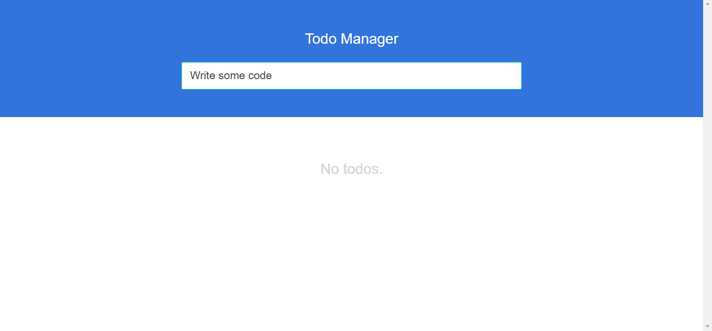
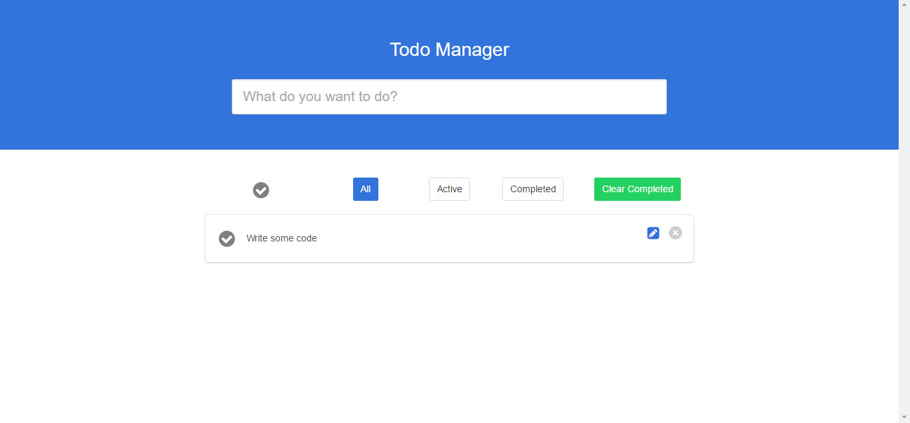
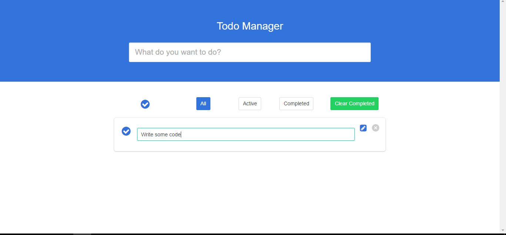

# Todo Demo App - Powered By Regularjs

This is a todo demo app using [Regularjs](http://regularjs.github.io/) framework, NEJ Utilities, NEJ Toolkit, Expressjs and MongoDB.

# Build and Run

1. Download the zip file or simple run ```git clone https://github.com/AndyRightNow/regular-todo-app.git``` in your command line window.

2. Run ```npm install``` first. For development server, run ```npm start```. For production server, run ```npm run serve```. These commands will first build the project and then run the server. If you want to stop the server when running in production mode, type ```pm2 stop www``` in your shell window. If there is a connection error with MongoDB or a connection timeout error during development mode, type in ```rs``` to re-run the server if you are in development server.

3. Go to ```http://localhost:3000``` to see the project.

4. Run ```npm run dev``` if you want to play with it yourself.

5. To run tests, first make sure you run ```npm start``` or ```npm run serve``` and the server is up and runing beforehand. Run ```npm run test``` to see the test results.

# Technology Stack

1. [**Express.js**](http://expressjs.com/) for server-side framework.
2. [**MongoDB**](https://www.mongodb.com) for database. Also [**Mongoose**](mongoosejs.com/) for database management and [**mLab**](https://mlab.com) for database hosting.
3. [**Regularjs**](http://regularjs.github.io/) for UI components.
4. [**Gulp**](http://gulpjs.com/) and [**NEJ Toolkit**](https://github.com/genify/toolkit2) for building.
5. [**Pug**](https://pugjs.org/) for HTML template.
7. [**NEJ**](https://github.com/genify/nej) for utilities and module system.
8. [**Bulma**](http://bulma.io/) for CSS framework.
9. [**NProgress**](http://ricostacruz.com/nprogress/) for Progress bar.
10. [**Axios**](https://github.com/mzabriskie/axios) for client requests in Server API tests.
11. [**Mocha**](https://mochajs.org/) for test framework and test runner.
12. [**Chai**](http://chaijs.com/) for test utilities and library.

# Screenshot Preview




